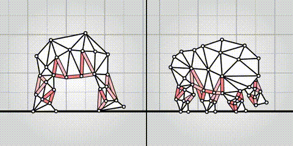

# morphology-adaptive

This repository demonstrates how a single locomotion controller can work with different shapes (biped and quadruped). It uses an attention mechanism to handle an arbitrary number of inputs, and the same module is shared across all muscles to support an arbitrary number of outputs.

More details in [this paper](https://juniorrojas.com/papers/2025-morphology-adaptive.pdf).

View animation in higher quality [here](https://www.youtube.com/watch?v=gmgyFIJz9ZY).

For simulation, this repository uses [Algovivo](https://github.com/juniorrojas/algovivo), originally built for the browser using WebAssembly, but here a native build is used to enable PyTorch integration.

The workflow [`trajectory-attn.yml`](.github/workflows/trajectory-attn.yml) runs the controller on both morphologies and generates a video. If you have your own copy or fork of this repository, you can [run the workflow from the GitHub Actions UI](https://docs.github.com/en/actions/managing-workflow-runs-and-deployments/managing-workflow-runs/manually-running-a-workflow), no local installation needed. Once it completes, the video will be saved as a workflow artifact and can be downloaded from the workflow run page.